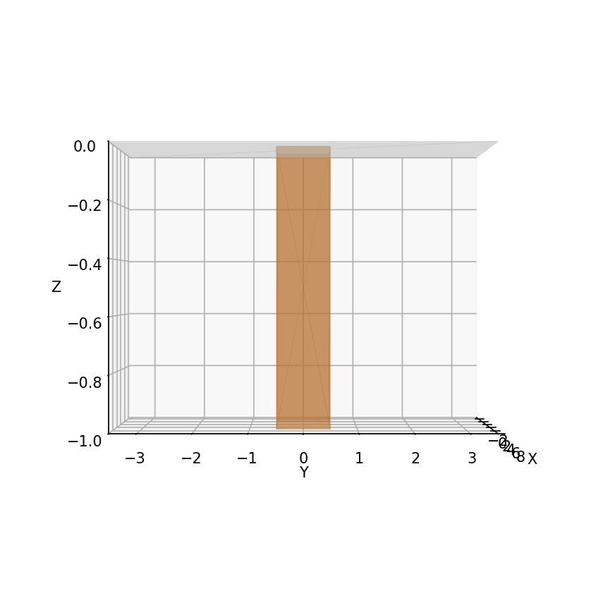
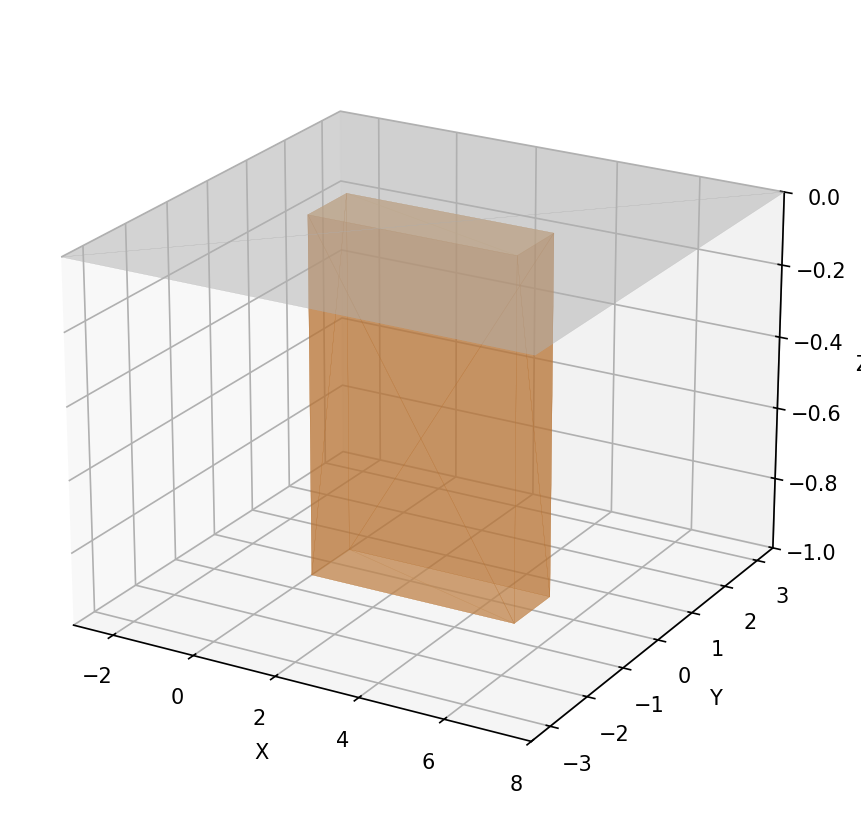
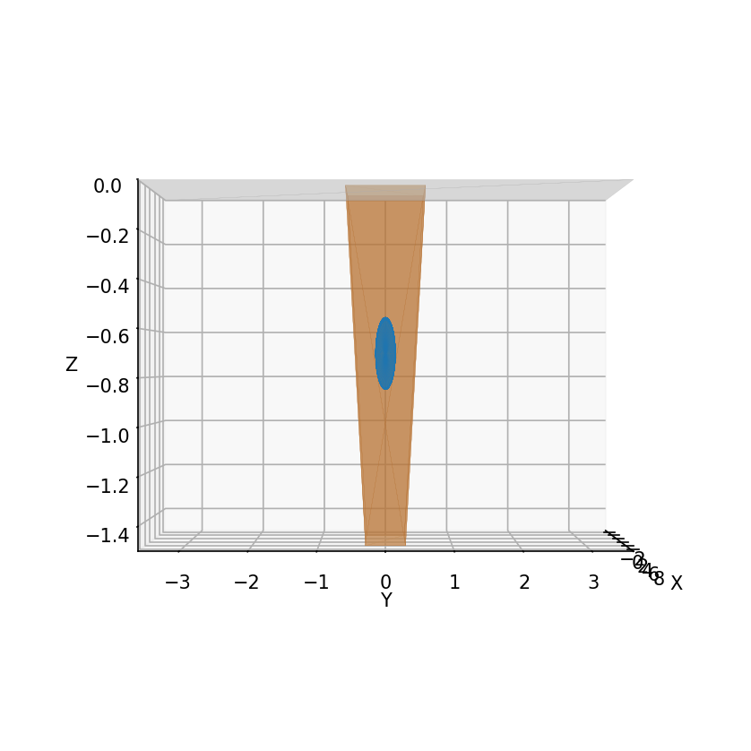
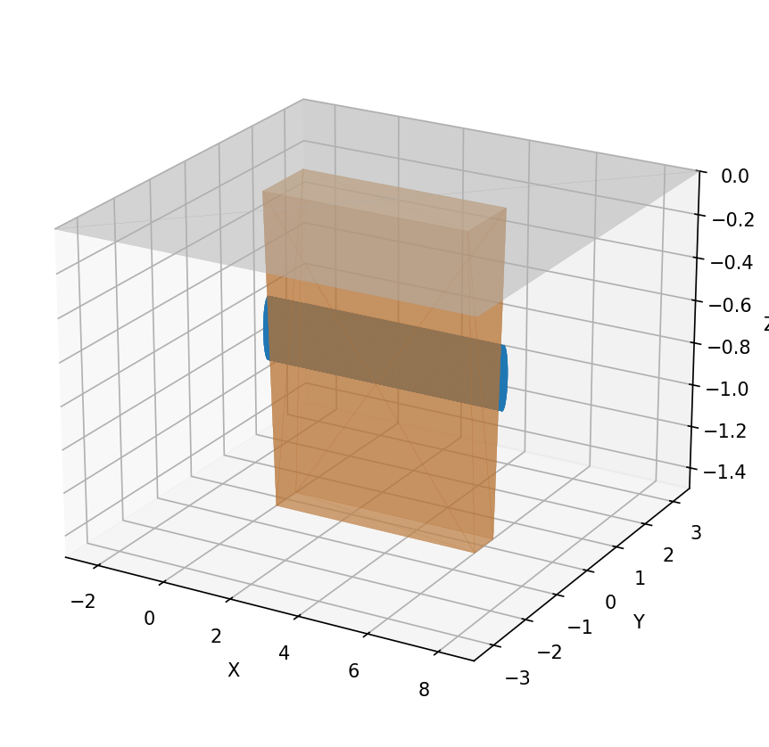
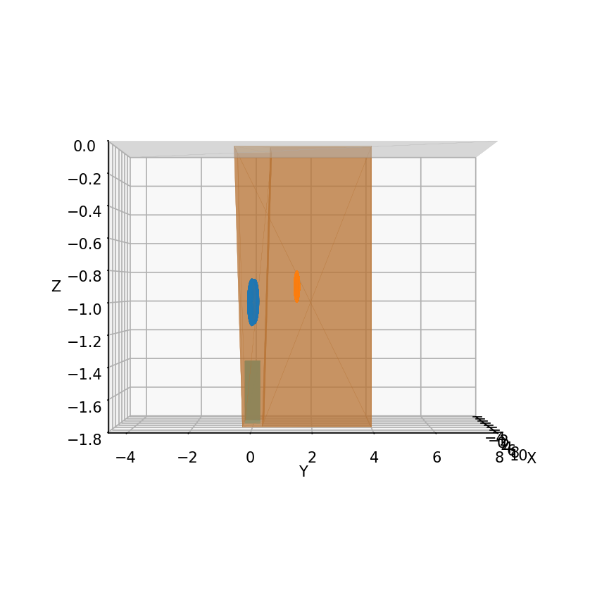
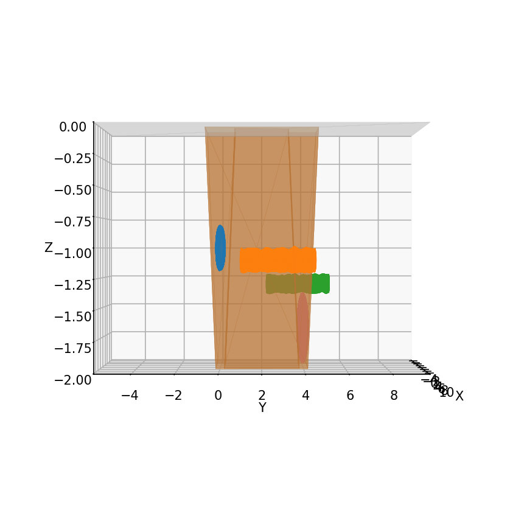
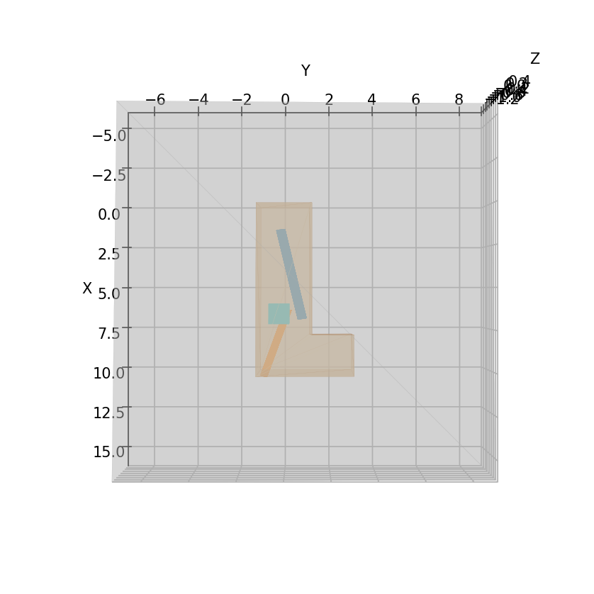
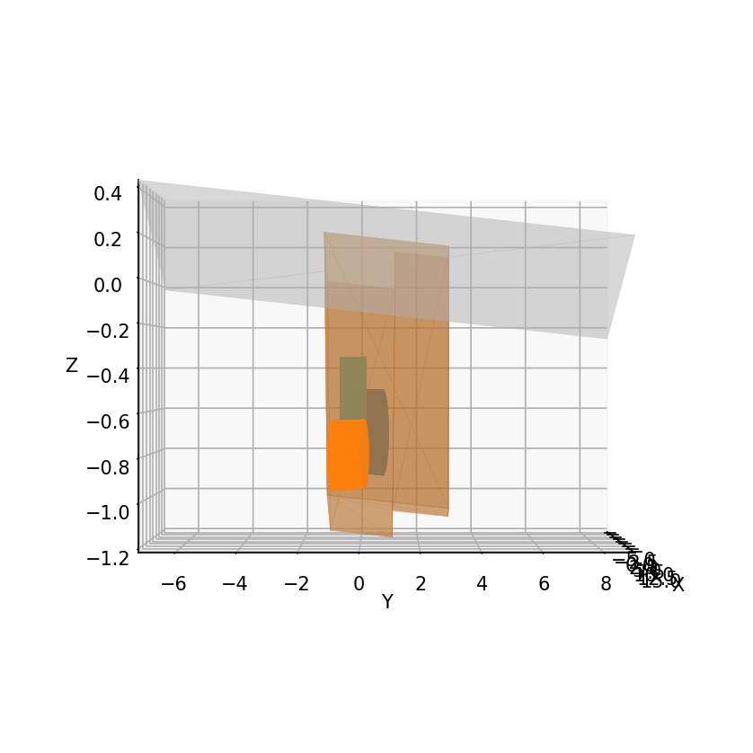
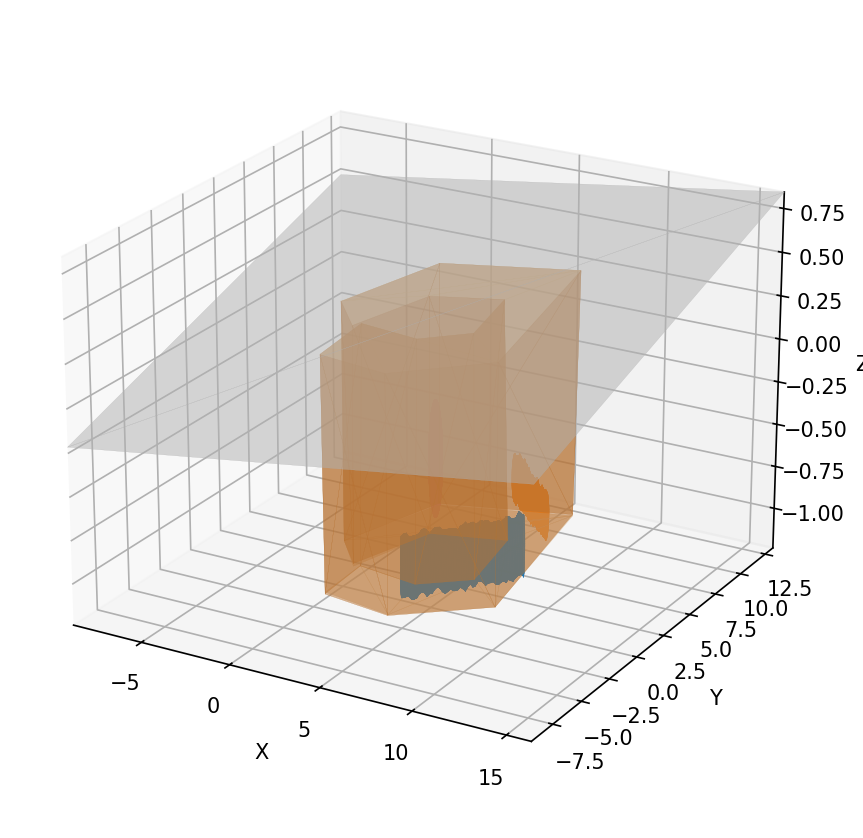

# Trenchfoot

Surface and volumetric trench mesh generator with shipped presets, Plotly previews, and a lightweight Python SDK.

## Install

```bash
pip install trenchfoot
```

Want volumetrics or visualisations? Install extras as needed:
- `pip install "trenchfoot[mesher]"` for gmsh-powered volume meshes.
- `pip install "trenchfoot[preview]"` for matplotlib snapshot renders.
- `pip install "trenchfoot[viz]"` for Plotly HTML viewers.

## Scenario Gallery

Color key: trench surfaces use warm soil tones; embedded geometry is colour-coded per group.

| Scenario | Top | Side | Oblique |
| --- | --- | --- | --- |
| S01_straight_vwalls |  |  |  |
| S02_straight_slope_pipe |  |  |  |
| S03_L_slope_two_pipes_box |  |  |  |
| S04_U_slope_multi_noise |  |  |  |
| S05_wide_slope_pair |  |  |  |
| S06_bumpy_wide_loop |  |  |  |

### S06 preset at a glance

```json
{
  "path_xy": [[0, 0], [4, -1], [8, 0], [8, 5], [2, 5], [-1, 2]],
  "width": 2.6,
  "depth": 1.4,
  "wall_slope": 0.12,
  "ground": {"z0": 0.2, "slope": [0.015, 0.03], "size_margin": 7.0},
  "pipes": [
    {"radius": 0.18, "length": 6.0, "angle_deg": 35, "s_center": 0.3, "z": -0.9, "offset_u": 0.35},
    {"radius": 0.14, "length": 4.8, "angle_deg": -40, "s_center": 0.6, "z": -0.95, "offset_u": -0.45}
  ],
  "spheres": [{"radius": 0.35, "s": 0.82, "offset_u": 0.3, "z": -0.65}],
  "noise": {
    "enable": true,
    "amplitude": 0.035,
    "corr_length": 0.5,
    "octaves": 4,
    "gain": 0.55,
    "apply_to": ["trench_walls", "trench_bottom", "pipe*_pipe_side"]
  }
}
```

## CLI quick start

```bash
trenchfoot-generate --help
trenchfoot-generate --preview --skip-volumetric --gallery docs/scenario_gallery.md
trenchfoot-plot packages/trenchfoot/scenarios/S05_wide_slope_pair/trench_scene.obj --open
```

Set `TRENCHFOOT_SCENARIO_OUT_ROOT=/tmp/trench-previews` (or another writable path) to keep generated assets out of your checkout.

## Python API

```python
from trenchfoot import scene_spec_from_dict, generate_surface_mesh, generate_trench_volume, gmsh_available

spec_dict = {
    "path_xy": [[0.0, 0.0], [5.0, 0.0]],
    "width": 1.0,
    "depth": 1.2,
    "pipes": [{"radius": 0.1, "length": 1.8, "angle_deg": 0.0, "s_center": 0.5}],
    "boxes": [],
    "spheres": [],
    "noise": {"enable": False},
}

scene = scene_spec_from_dict(spec_dict)
surface = generate_surface_mesh(scene, make_preview=True)
surface.persist("./surface")

if gmsh_available():
    volume = generate_trench_volume(spec_dict, lc=0.4, persist_path="./volume/trench_volume.msh")
```

`SurfaceMeshResult` keeps per-group faces, metrics, and optional preview PNG bytes; call `.persist(...)` when you need files. `VolumeMeshResult` exposes node coordinates, elements, and physical groups while still letting you stay in memory.

## Testing

```bash
pytest -rs
```

The suite exercises each preset (surface + volumetric), the gallery helpers, and the SDK smoke paths.
