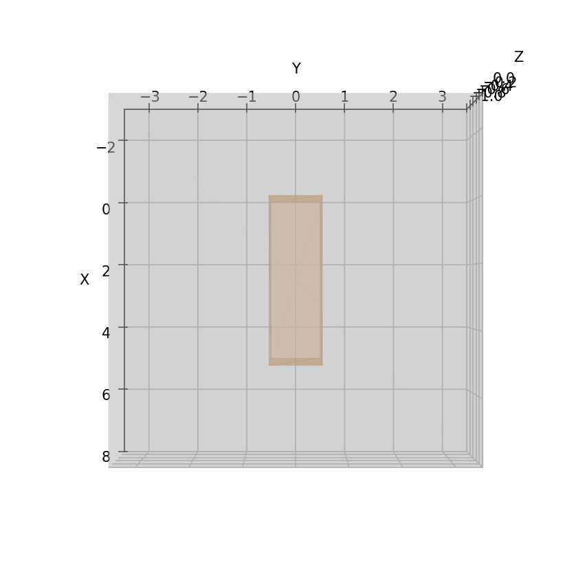
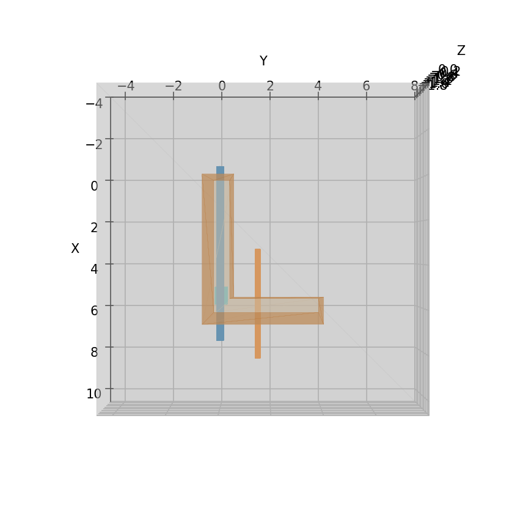
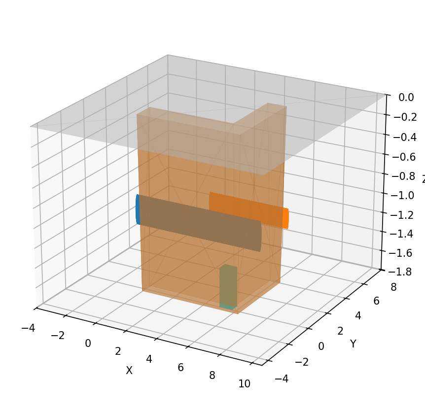
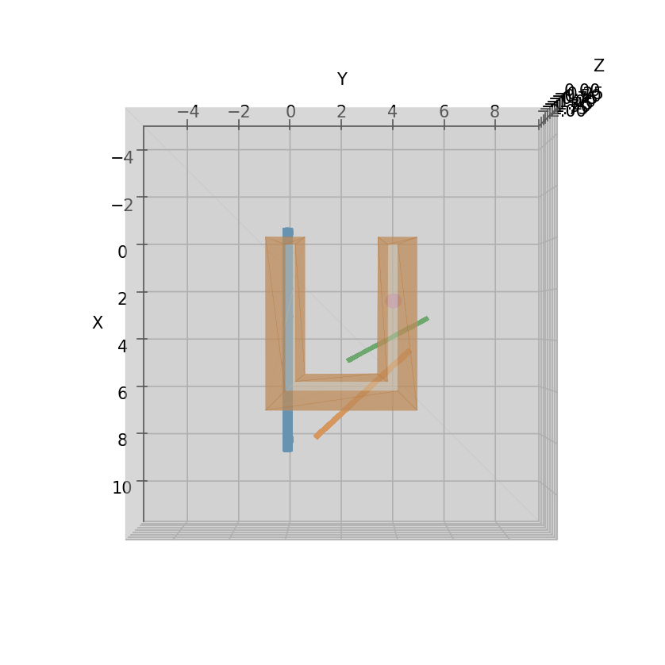
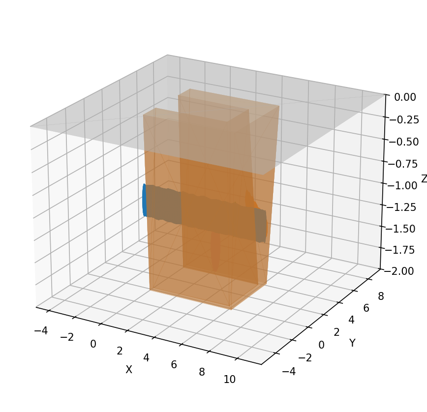
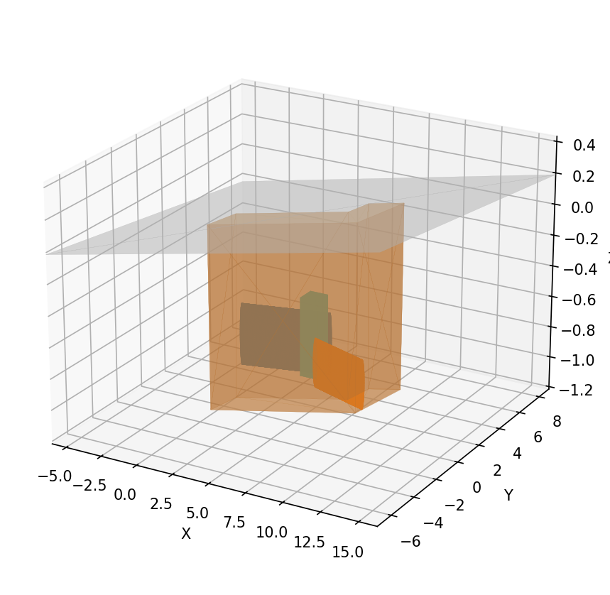
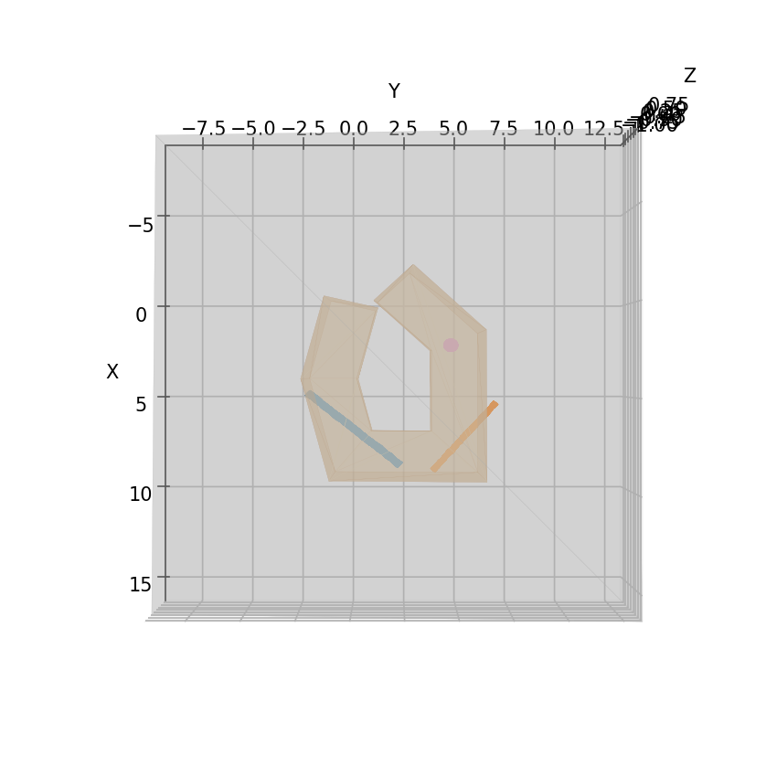
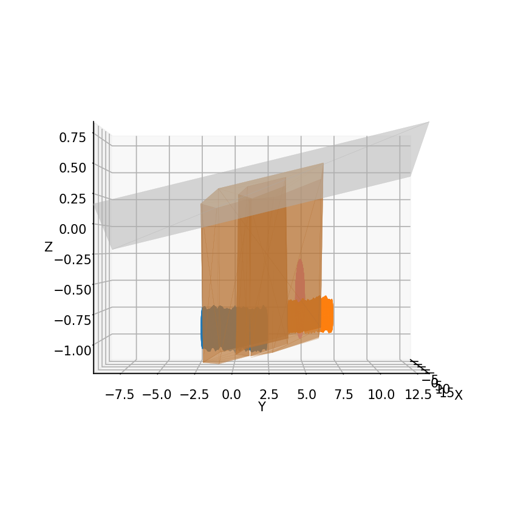

# Trenchfoot

Synthetic trench scenario generator extracted from the Survi monorepo. This repository bundles
surface + volumetric scene generation tooling and prebuilt scenarios.

## Layout
- `packages/trenchfoot/`: the generator bundle (surface CLI, Gmsh mesher, scenario specs, Dockerfile).
- `packages/trenchfoot/scenarios/`: prebuilt scenes (OBJ meshes, previews, metrics).

## Getting Started
```bash
uv sync
uv run python -m trenchfoot.generate_scenarios --help
```

Optional extras:
- Install `gmsh` and `meshio` to emit volumetric meshes.
- Install `matplotlib` to refresh preview renders.
- Set `TRENCHFOOT_SCENARIO_OUT_ROOT=/tmp/trench-previews` (or another writable path) to keep generated assets out of the repo checkout; the CLI uses this location unless `--out` is specified.
- Install `plotly` via `pip install "trenchfoot[viz]"` to enable Plotly HTML meshes.
- Use `uv run python -m trenchfoot.generate_scenarios --preview --gallery docs/scenario_gallery.md` to regenerate previews and emit a Markdown gallery (the README table below was generated this way).

See `packages/trenchfoot/README.md` for the original usage notes and the CLI examples.

### CLI Shortcuts
- `uv run python -m trenchfoot.generate_scenarios --scratch --skip-volumetric` runs the generator in a temporary directory (no repo churn) and prints the scratch path.
- Add `--include-prebuilt` if you want the shipped assets copied into the scratch directory before regeneration.
- Combine `--preview` with `--gallery docs/scenario_gallery.md` to refresh previews and the Markdown gallery in one go.
- `trenchfoot-plot packages/trenchfoot/scenarios/S05_wide_slope_pair/trench_scene.obj --open` writes an interactive Plotly HTML (requires the `[viz]` extra) and opens it in your browser.

## Python API

Trenchfoot now exposes a light-weight SDK so you can work entirely in memory:

```python
from trenchfoot import (
    SceneSpec,
    scene_spec_from_dict,
    generate_surface_mesh,
    generate_trench_volume,
    gmsh_available,
)

spec_dict = {
    "path_xy": [[0.0, 0.0], [5.0, 0.0]],
    "width": 1.0,
    "depth": 1.2,
    "wall_slope": 0.1,
    "ground": {"z0": 0.0, "slope": [0.0, 0.0], "size_margin": 2.0},
    "pipes": [{"radius": 0.1, "length": 1.8, "angle_deg": 0.0, "s_center": 0.5}],
    "boxes": [],
    "spheres": [],
    "noise": {"enable": False},
}

scene = scene_spec_from_dict(spec_dict)
surface = generate_surface_mesh(scene)
print(surface.metrics["surface_area_by_group"]["trench_walls"])
surface.persist("./tmp/surface", include_previews=False)

if gmsh_available():
    volume = generate_trench_volume(spec_dict, lc=0.4, persist_path="./tmp/volume/trench_volume.msh")
    print(len(volume.element_blocks), "element blocks", "across", volume.nodes.shape[0], "nodes")
```

`SurfaceMeshResult` keeps the per-group vertex/face arrays, metrics, and optional preview PNGs (as bytes). Call `.persist(path)` when you want OBJ + metrics written to disk. `VolumeMeshResult` exposes the raw node coordinates, element connectivity, and the discovered physical groups while still letting you emit `.msh` files on demand.

## Mesh Clearance Guard Rails
The volumetric mesher enforces a minimum 50 mm gap between the trench walls and any embedded geometry, scaling the threshold with each pipe’s radius and the current wall slope. When clearance gets tight, the generator shortens the pipe run and records per-pipe margins in `SUMMARY.json` under `pipe_clearances` so you can spot scenarios that are at risk before Gmsh complains.

## Scenario Gallery
Color key: trench surfaces use warm soil tones, embedded geometry is color-coded per object (pipes in rotating palette, boxes teal/olive, spheres magenta/gray).
| Scenario | Top | Side | Oblique |
| --- | --- | --- | --- |
| S01_straight_vwalls |  |  |  |
| S02_straight_slope_pipe |  |  |  |
| S03_L_slope_two_pipes_box |  |  |  |
| S04_U_slope_multi_noise |  |  |  |
| S05_wide_slope_pair |  |  |  |
| S06_bumpy_wide_loop |  |  |  |

## Testing
```bash
uv run pytest -rs
```
The test suite exercises the single-scenario code path, runs all bundled presets (surface + volumetric) into a scratch directory, and checks that the CLI honours `TRENCHFOOT_SCENARIO_OUT_ROOT`.
